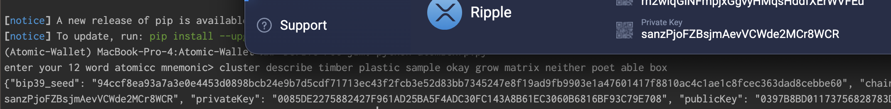

# ATOMIC-WALLET-XRP-DERIVATION

The mystery solved, more or less by accident. Don't believe everything you hear from the FBI or that Zach guy or whatever.



## Installation

```bash
# pip install -r requirements.txt
```

## Usage

Follow instructions, use Python 3.13 (Coincurve does not compile on 3.14). Also, this literally only works concerning Atomic Wallet and XRP. 

## So what's the deal?

The reason why nobody seems to be able to replicate this was not some super secret security mechanism. It's in fact because at some very early point in development, the chaincode was fed into the rest of the Rube Goldberg machinery of derivation instead of the actual private key, and as a result, the output is both deterministic and effectively never going to be the "correct" one. This is also why some valid mnemonics won't work in Atomic Wallet, I posit, but I don't have time to test that.

If someone stole your XRP from Atomic Wallet, namely the 2022 "breach", it's highly unlikely that it was the North Koreans, since the compiled apk contained the libraries that were identical, and thus, also this error. One would think that if the sabotage happened with the vendored libraries they'd catch this error and in turn, stole all other coins but your XRP, or only stole your XRP and causing a much weirder situation. Of course, I have no first hand knowledge that the FBI actually confirmed anything, I would know, as I was a CJA attorney and getting god damn relevant evidence from the FBI was already like pulling teeth. But if they did, well attribution is a fool's errand even today, considering that a real life regulatory body with enforcement powers tried to sanction a smart contract which is just compiled code on the blockchain that exists on thousands of computers at the same time and had to pretend like they didn't. [They absolutely did.](http://www.ca5.uscourts.gov/opinions/pub/23/23-50669-CV0.pdf) 

I have no theories as to what actually happened, but behavior of coins being moved on chain is not a good heuristic for attribution, because it is so easily copied intentionally. Is North Korea hacking some crypto infrastructure? Probably. Are they responsible for everything attributed? Hell no, for one, it'd look a lot like random Chinese teens doing it in any case, since American paranoia has meant that random ass sites block whole countries from accessiing directly and if you know how much effort it takes to teach  your 60 something dad how to use a proxy to check his bank balance, you'd know that what is simple to some is like climbing Mt. Everest naked for others. But I'd imagine that since resources are never unlimited and they are dumped in a walled garden to begin with, it's not North Korea who is going after your measly balance, unless you have enough in your wallet to fund a nuclear missile or something. In that case, the problem might be in part on you, buddy.

## License

This project is licensed under the CC0 license because god damn Germans don't have a proper public domain for me to release this into — see [LICENSE](LICENSE) for details. But really this should be considered as released into the public domain in all other jurisdictions (my code only, since I have no way to assign the rights of code written by others contained in the libraries used.). Also get your shit together Germany, if I create something, I have the right to give it to nobody in particular, that's how private property works, dang it.
